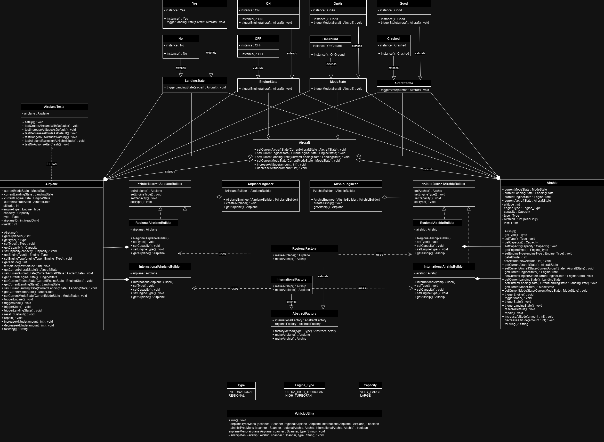

# Aircraft Management _ Applied Design Patterns

This repository contains a Java application that implements three design patterns: `Builder`, `Abstract Factory`, and `State` patterns. The project also includes comprehensive **JUnit** tests to verify functionality and ensure smooth operation.

## 📝 Description

The **Aircraft Management System** is a simulation that models the behavior of aircraft using various design patterns. The primary goal is to apply these design patterns to structure an application that can manage aircraft attributes, states, and operations effectively.

This project implements:

- **Builder Pattern**: For constructing complex airplane and airship objects step by step.
- **Abstract Factory Pattern**: To create families of related objects without specifying their concrete classes.
- **State Pattern**: To manage different states of the aircraft such as engine state, landing state, and mode.

A test suite using **JUnit** ensures all parts of the system function as intended, covering scenarios like altitude changes, aircraft crashes, and repair procedures.

  

The UML diagram above illustrates the relationships between the classes in this project.

## 🚀 Deployment

This project is structured to be deployed and run locally using IntelliJ IDEA or any Java-compatible IDE. The following steps outline how to clone and run the project.

### 💻 Installation

To get the project up and running locally:

```bash
# Clone the repository
git clone https://github.com/tuanh00/AircraftManagement_DesignPatterns.git

# Navigate into the project directory
cd AircraftManagement_DesignPatterns

# Open the project in IntelliJ IDEA (or your preferred Java IDE)
# Ensure JUnit is available for unit testing
```
## 📋 Requirements
- Java version 20.0.2
- JUnit for testing version 5.8.1
## 🎨 Features
Design Patterns: Implements Builder, Abstract Factory, and State patterns for structured and scalable code.
Aircraft States: The aircraft can be in different states (e.g., Crashed, Good, On, Off, OnGround, InAir).
Testing: A JUnit test helps to verify the correctness of aircraft operations.
UML Diagram: A UML diagram illustrates the overall system design.
## 📜 Unit Testing
The test suite checks the following scenarios:
- Airplane Creation: Testing the creation of an airplane with default values.
```bash
  @Test
    @DisplayName("Create an airplane with default values")
    void testCreateAirplaneWithDefaults() {
        assertNotNull(airplane, "Airplane should be created");
        assertEquals(1, airplane.getAirplaneId(), "First airplane ID should be 1");
        assertEquals(Good.Instance(), airplane.getCurrentAircraftState(), "Default aircraft state should be Good");
        assertEquals(OFF.Instance(), airplane.getCurrentEngineState(), "Default engine state should be Off");
        assertEquals(No.Instance(), airplane.getCurrentLandingState(), "Default landing state should be No");
        assertEquals(OnGround.Instance(), airplane.getCurrentModeState(), "Default mode state should be OnGround");
        assertEquals(0, airplane.getAltitude(), "Default altitude should be 0");
    }
```
- Altitude Changes: Ensuring the aircraft can increase and decrease altitude safely.
```bash
 @Test
    @DisplayName("Decrease altitude under safe conditions")
    void testDecreaseAltitudeAsDefault() {
        airplane.increaseAltitude(-1);
        airplane.triggerMode();
        airplane.decreaseAltitude(1000);

        ModeState currentModeState = airplane.getCurrentModeState();
        LandingState currentLandingState = airplane.getCurrentLandingState();

        assertEquals(OnGround.Instance(), currentModeState, "Should be on ground");
        assertEquals(Yes.Instance(), currentLandingState, "Should be in landing");
        assertEquals(0, airplane.getAltitude(),
                "Altitude should be decrease to 0");
    }
```
- Handling dangerous altitude warnings and airplane crashes.
```bash
    @Test
    @DisplayName("Test for dangerous altitude warning")
    void testDangerousAltitudeWarning() {
        airplane.increaseAltitude(10000);
        AircraftState currentState = airplane.getCurrentAircraftState();
        assertEquals(Good.Instance(), currentState, "Should warn of dangerous altitude at 10000 feet");
    }
```
- Crash and Repair: Simulating an aircraft crash and testing the repair functionality.
```bash
 @Test
    @DisplayName("No actions allowed after crash except repair")
    void testNoActionsAfterCrash() {
        airplane.increaseAltitude(12000); // This should crash the airplane

        // Assert airplane is still crashed
        assertEquals(Crashed.Instance(), airplane.getCurrentAircraftState(), "Should explode at 12000 feet");
        // Then repair and check states
        airplane.repair();
        assertAll(
                () -> assertEquals(1, airplane.getAirplaneId(), "First airplane ID should be 1"),
                () -> assertTrue(airplane.getCurrentAircraftState() instanceof Good, "Airplane should be in Good state after repair."),
                () -> assertTrue(airplane.getCurrentEngineState() instanceof OFF, "Engine should be OFF after repair."),
                () -> assertTrue(airplane.getCurrentLandingState() instanceof No, "Landing state should be NO after repair."),
                () -> assertEquals(0, airplane.getAltitude(), "Altitude should be reset to 0 after repair.")
        );
    }
```
## 👥 Contributing
Contributions are welcome! If you find a bug or have suggestions for new features or improvements, feel free to open an issue or submit a pull request.
